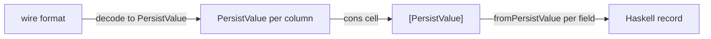
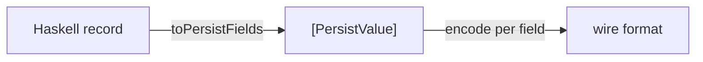

# RFC: Direct Row Codecs for persistent

## Status

Draft. I have a proof-of-concept implementation PostgreSQL that I'm getting into a publishable state.

## Summary

Add a backend-agnostic direct codec layer to persistent that bypasses `PersistValue` entirely. On the **decode** side, typed query results go from the database's wire format to Haskell records without intermediate representations. On the **encode** side, Haskell values go from record fields to the wire format without detouring through `PersistValue`.

The decode path uses continuation-passing style (CPS) throughout, so the success path allocates zero `Either` constructors and zero `PersistValue` wrappers. The encode path operates similarly, but in the opposite direction.

The existing `PersistValue`-based path is unchanged. All current code continues to compile and run without modification.

## Motivation

### Allocation overhead

Every row decoded from any persistent backend follows this path today:



For a 10-column row, this allocates:
- 10 `PersistValue` heap objects (tagged union, 2+ words each)
- 10 list cons cells (3 words each)
- ~9 intermediate `Either Text (a -> b -> ...)` values from the applicative `fromPersistValues` chain
- Then `fromPersistValue` pattern-matches each `PersistValue` again to extract the payload

That works out to roughly 70 words (~560 bytes) of pure overhead per row, all short-lived. For a 100k row result set, this produces ~56MB of intermediate garbage that exists only to be collected.

Encoding has a symmetric problem: `toPersistFields` converts each record field into a `PersistValue`, then the backend immediately inspects it to produce the wire format. Every insert and update pays this cost.

### Limited type vocabulary

`PersistValue` has a fixed set of constructors that cannot represent backend-specific types natively. This implementation was chosen back in the 2010s when the most common backends were MySQL and PostgreSQL, and the most common use cases were simple CRUD operations. Nowadays, production-grade applications often need to support more types, often with database-specific support. In order to support these types, we currently have to shoehorn them into the existing constructors, losing type safety and precision. Examples from the PostgreSQL backend include:

- **JSON/JSONB**: stored as `PersistByteString`, losing the distinction between JSON and raw bytes
- **UUID**: stored as `PersistLiteralEscaped` with hex-encoded bytes, requiring a text-to-UUID conversion on each read
- **Intervals**: stored as `PersistRational`, losing semantic meaning (PostgreSQL's `interval` has year/month/day/time components that `Rational` cannot faithfully represent)
- **Composite types**: PostgreSQL composite values have no `PersistValue` representation at all
- **Inet/cidr**: IP address types round-trip through `PersistLiteralEscaped`
- **Arrays of custom types**: `PersistList`/`PersistArray` elements must themselves be `PersistValue`, so arrays of domain types require double conversion
- **Enums**: backend enums are sent as text with no type safety at the Haskell boundary

Furthermore, heavily using the custom type support makes it harder to improve the underlying library- for example, we could switch to the binary protocol that PostgreSQL supports, but custom values all need to be converted to use the binary protocol, or at least audited to ensure they are compatible.

This means that nearly any changes to the underlying library constitutes a breaking change for all users of the library, which is long-term unsustainable.

With the proposed `FieldDecode`/`FieldEncode` classes, backend packages can provide instances for any Haskell type directly, and the type mapping is no longer constrained by `PersistValue`'s fixed vocabulary. This gives us significant flexibility to improve the underlying library without introducing breaking changes for users.

### Runtime type checks

`fromPersistValue` performs runtime pattern matching on the `PersistValue` constructor at every field–  effectively a type check that the schema already guarantees at compile time. The direct path eliminates this redundancy: TH generates code that calls the correct decoder for each field's statically-known type.

### Extensibility without breaking changes

When a database adds a new type (or a backend author wants to support an existing type more faithfully), persistent's current architecture requires either adding a constructor to `PersistValue` (a breaking change to every backend and every `PersistField` instance) or cramming the value into an existing constructor like `PersistLiteralEscaped` (lossy, with no type safety).

With `FieldDecode`/`FieldEncode`, a backend package can add support for any new type by publishing a new instance- without touching persistent core, without coordinating with other backends, and without breaking any downstream users. A PostgreSQL backend could add `FieldDecode PgRowEnv HStore` or `FieldDecode PgRowEnv TSVector` the day PostgreSQL ships them. Users who don't reference these types are completely unaffected.

### Stable SQL for prepared statements and pipelining

Today, persistent generates bulk inserts by expanding `INSERT INTO t VALUES (?,?,?), (?,?,?), ...` with one bind parameter per value. For 10k rows of 10 columns, that's 100k bind parameters and a SQL string whose length changes with every batch–  defeating prepared statement caching and forcing the database to re-plan the query each time.

Similarly, `WHERE id IN (?,?,?,...)` expands to a variable number of bind parameters.

The direct encode path opens the door to column-oriented encoding: a single fixed SQL template like `INSERT ... SELECT * FROM UNNEST($1, $2, ...)` where each parameter is an array of all values for one column, or `WHERE id = ANY($1)` with a single array parameter. The SQL string stays the same regardless of how many rows or values are involved, which is a prerequisite for proper prepared statement reuse.[^pipeline]

[^pipeline]: Fixed SQL templates are also a prerequisite for prepared statements, which parse and plan the SQL once and execute it many times. Variable-length SQL strings change with every batch size, so they can never be prepared: every call is a cold parse and plan. Prepared statements in turn enable *protocol-level pipelining*: sending multiple execute messages to the database without waiting for each response before sending the next (see PostgreSQL's [pipeline mode](https://www.postgresql.org/docs/current/libpq-pipeline-mode.html)). Pipeline mode doesn't require prepared statements, but unless prepared statements can be run with a consistent set of parameters, you can't use them effectively in pipeline mode since you have to create a huge number of them.

## Design: Decoding

### Core abstraction: `RowReader` + `FieldDecode` + `FromRow`

I propose introducing three new types/classes in persistent core, all backend-agnostic:

```haskell
-- CPS column-cursor monad
newtype RowReader env a = RowReader
    { unRowReader
        :: forall r. env -> Counter
        -> (Text -> IO r)   -- on error
        -> (a -> IO r)      -- on success
        -> IO r
    }

-- Per-field direct decoding, split into prepare + run.
class FieldDecode env a where
    -- | Inspect column metadata once per result set, returning a
    --   specialized runner that can decode every row without
    --   re-checking types.
    prepareField
        :: env -> FieldNameDB -> Int
        -> (Text -> IO r) -> (FieldRunner env a -> IO r) -> IO r

-- | The product of 'prepareField'. Runs on each row with only the
--   row-varying data (row index, raw bytes, etc.)- column type
--   dispatch has already happened.
newtype FieldRunner env a = FieldRunner
    { runField :: forall r. env -> (Text -> IO r) -> (a -> IO r) -> IO r }

-- Per-entity direct decoding. TH generates instances.
class FromRow env a where
    rowReader :: RowReader env a
```

`env` is an opaque, backend-specific type that carries whatever the backend needs to read a column: a result pointer and row index for SQL databases, a BSON document for MongoDB, a key-value list for Redis, etc.

The key insight behind the prepare/run split is that within a single result set, the column types are fixed: every row has the same OIDs (PostgreSQL), the same field types (MySQL), or the same BSON structure (MongoDB). `FromRow` exposes a `prepareRow` method that runs `prepareField` for each column once per result set, producing a `RowDecoder` that captures the resolved `FieldRunner`s in a closure. The per-row loop then calls only `runField`–  no OID dispatch, no vector index, no branching on column types.

```haskell
-- Produced by prepareRow: no Counter needed, column positions
-- are baked into the captured FieldRunners.
newtype RowDecoder env a = RowDecoder
    { runRowDecoder :: forall r. env -> (Text -> IO r) -> (a -> IO r) -> IO r }
```

The conduit loop prepares once against the first row's metadata, then reuses the decoder:

```haskell
ctr <- newCounter
decoder <- prepareRow metaEnv ctr onErr pure   -- runs prepareField × N columns
-- per-row loop: only runField, zero dispatch
go decoder row rowCount = ...
    val <- runRowDecoderCPS decoder (PgRowEnv ret row colTypes cache) onErr pure
    yield val
```

`FromRow` instances built from `nextField` (via `rowReader`) still work–  the default `prepareRow` falls back to calling `rowReader` per row. TH-generated instances and the stock tuple instances provide real `prepareRow` implementations that capture the runners.

`FieldDecode` takes both a `FieldNameDB` (for document stores that look up fields by name) and an `Int` column index (for SQL backends that read by position). Each backend uses whichever access pattern is natural and ignores the other.

### Why CPS?

A naive `IO (Either Text a)` return type allocates a `Right` constructor at every step in the applicative chain, even on the success path where the error case is never used. With CPS, the success continuation is passed directly and the `Either` is never constructed:

```haskell
RowReader ff <*> RowReader fa = RowReader $ \env ctr onErr onOk ->
    ff env ctr onErr $ \f ->
        fa env ctr onErr $ \a ->
            onOk (f a)
```

Both `prepareField` and `FieldRunner` are CPS too, so the backend's decoder feeds its result directly into the continuation. Callers use `runRowReaderCPS` to supply their success and failure actions without materializing unnecessary values:

```haskell
val <- runRowReaderCPS rowReader env ctr
    (throwIO . PersistMarshalError)  -- on error: throw directly
    pure                              -- on success: return value directly
yield val
```

The entire path from wire format to `yield` produces zero `Either` constructors and zero `PersistValue` wrappers.

### TH generates `FromRow` alongside `PersistEntity`

For an entity `User { userName :: Text, userAge :: Maybe Int }`, `mkPersist` generates both the existing `PersistEntity` instance (unchanged) and a new `FromRow` instance:

```haskell
instance (FieldDecode env Text, FieldDecode env (Maybe Int))
      => FromRow env User where
    rowReader = User
        <$> nextField (FieldNameDB "name")
        <*> nextField (FieldNameDB "age")
```

Under the hood, `nextField` calls `prepareField` on the first row and caches the resulting `FieldRunner`, then applies `runField` for each subsequent row. The instance is polymorphic over `env`–  the `FieldDecode` constraints resolve when a concrete backend is chosen, and the entity definition itself remains backend-agnostic.

### Backend implementations

Each backend provides its own `env` type and `FieldDecode` instances. The same TH-generated `FromRow` code works across all of them without modification.

#### PostgreSQL

I've got a prototype implementation that fully passes all tests for persistent and esqueleto. The `env` environment value wraps a `PGresult` handle, a row index, a vector of column OIDs classified into a `PgType` ADT, and an `OidCache` for resolving dynamically-assigned OIDs (composites, enums, domains). `FieldDecode` instances inspect the `PgType` once during `prepareField` and return a `FieldRunner` that calls the appropriate `postgresql-binary` decoder directly, without re-checking the OID on each row. Instances cover `Bool`, `Int16`-`Int64`, `Int`, `Double`, `Scientific`, `Rational`, `Text`, `ByteString`, `Day`, `TimeOfDay`, `UTCTime`, and `Maybe a`. Backend-specific types like `UUID`, `IPRange`, `DiffTime`, `Value` (JSON), and composite types can be added as further instances without any changes to persistent core. Compound types (arrays, composites) are handled by a value-level `PgDecode`/`PgEncode` layer that composes through the binary wire format (see "Compound types" below).

```haskell
-- Sketch (simplified from the prototype):
instance FieldDecode PgRowEnv Text where
    prepareField env _ col onErr onOk = do
        pgType <- columnType env col
        case pgType of
            Scalar PgText    -> onOk (FieldRunner $ \env' onErr' onOk' -> readBytes env' col >>= decodeWith textDecoder onErr' onOk')
            Scalar PgVarchar -> onOk (FieldRunner $ \env' onErr' onOk' -> readBytes env' col >>= decodeWith textDecoder onErr' onOk')
            _                -> onErr ("type mismatch: expected text, got " <> show pgType)
```

The `case pgType of` branch runs once per result set via `prepareRow`. On subsequent rows, only the captured `FieldRunner` executes–  no OID lookup, no branching on column types.

#### SQLite

The environment wraps a `Sqlite.Statement`. SQLite's dynamic typing means the column type can technically vary per row, so `prepareField` here is lightweight, but it still validates that the column index is in range and captures the statement reference, keeping the per-row `FieldRunner` simple.

```haskell
instance FieldDecode SqliteRowEnv Text where
    prepareField (SqliteRowEnv stmt) _ col onErr onOk =
        onOk $ FieldRunner $ \(SqliteRowEnv stmt') onErr' onOk' -> do
            ty <- Sqlite.columnType stmt' (colIdx col)
            case ty of
                Sqlite.NullColumn -> onErr' "unexpected NULL for Text"
                _                 -> Sqlite.columnText stmt' (colIdx col) >>= onOk'
```

#### MySQL

The environment wraps a vector of `MySQLBase.Field` metadata and a vector of `Maybe ByteString` row data. `prepareField` captures the field metadata once, and the returned `FieldRunner` uses it to call `MySQL.convert` on each row's data without re-reading the metadata.

```haskell
instance FieldDecode MySQLRowEnv Text where
    prepareField env _ col onErr onOk =
        let field = mysqlFields env V.! col
        in onOk $ FieldRunner $ \env' onErr' onOk' ->
            case mysqlRow env' V.! col of
                Nothing -> onErr' "unexpected NULL for Text"
                Just bs -> case MySQL.convert field bs of
                    Just t  -> onOk' t
                    Nothing -> onErr' "MySQL: cannot convert to Text"
```

#### MongoDB

The environment wraps a BSON `Document`. `FieldDecode` looks up fields by name (ignoring the column index), which is why the class takes both parameters. For MongoDB, the prepare step is essentially a no-op since each document is self-describing, but the split still keeps the interface uniform.

```haskell
instance FieldDecode MongoRowEnv Text where
    prepareField _ name _ onErr onOk =
        onOk $ FieldRunner $ \(MongoRowEnv doc) onErr' onOk' ->
            case DB.look (unFieldNameDB name) doc of
                Just (DB.String t) -> onOk' t
                Just DB.Null       -> onErr' "unexpected NULL for Text"
                Nothing            -> onErr' ("missing field: " <> unFieldNameDB name)
                _                  -> onErr' "expected String"

-- Distinguishes absent fields from null fields:
instance FieldDecode MongoRowEnv a => FieldDecode MongoRowEnv (Maybe a) where
    prepareField env name col onErr onOk =
        prepareField env name col onErr $ \inner ->
            onOk $ FieldRunner $ \(MongoRowEnv doc) onErr' onOk' ->
                case DB.look (unFieldNameDB name) doc of
                    Nothing      -> onOk' Nothing
                    Just DB.Null -> onOk' Nothing
                    _            -> runField inner (MongoRowEnv doc) onErr' (onOk' . Just)
```

#### Redis

The environment wraps binary-encoded key-value pairs. Like MongoDB, `FieldDecode` looks up by field name. The prepare step captures the encoded field name to avoid re-encoding it on every lookup.

```haskell
instance FieldDecode RedisRowEnv Text where
    prepareField _ name _ onErr onOk =
        let key = encodeUtf8 (unFieldNameDB name)
        in onOk $ FieldRunner $ \(RedisRowEnv pairs) onErr' onOk' ->
            case V.find (\(k, _) -> k == key) pairs of
                Just (_, bs) -> case Binary.decode (L.fromStrict bs) of
                    BinPersistText t -> onOk' t
                    _                -> onErr' "expected Text"
                Nothing -> onErr' ("missing field: " <> unFieldNameDB name)
```

#### How `FromRow` unifies all backends

The same TH-generated instance resolves to different concrete code depending on the `env` type. The prepare/run split means that backends with uniform column types (PostgreSQL, MySQL) get the type dispatch out of the hot loop, while document stores (MongoDB, Redis) still benefit from the uniform interface even though their "prepare" step is lighter.

| `env` | What `prepareField` inspects | What `FieldRunner` reads from |
|-------|------------------------------|-------------------------------|
| PostgreSQL | column OID + `OidCache` for composites/enums | binary row data via `postgresql-binary` decoders |
| SQLite | (lightweight–  validates column index) | `sqlite3_column_*` C API per row |
| MySQL | `MySQLBase.Field` metadata | `Maybe ByteString` row data + `MySQL.convert` |
| MongoDB | (no-op–  documents are self-describing) | `DB.look` on BSON `Document` (by field name) |
| Redis | encodes field name to `ByteString` | `Binary.decode` from key-value pair |

The entity definition contains no backend-specific code, and `PersistValue` appears nowhere in the decode path.

### Specialization: eliminating dictionary overhead

The `FromRow` and `FieldDecode` instances are polymorphic over `env`, which means that in the general case GHC passes typeclass dictionaries at runtime: an indirect function call per field, per row. For a 10-column entity over 100k rows, that's a million indirect calls that could be direct invocations insteadj.

The standard fix is `SPECIALIZE` pragmas. Backend packages can emit specializations for their concrete `env` type, and we will extend TH to generate them automatically from the `MkPersistSettings`.

In order to achieve this, `mkPersist` will gain a new configuration field `mpsDirectEnvTypes :: [Name]` for environments that consumers want to be specialized. When this list contains `'PgRowEnv`, the generated `FromRow` instance for an entity `User` looks like:

```haskell
instance (FieldDecode env Text, FieldDecode env (Maybe Int))
      => FromRow env User where
    rowReader = User <$> nextField "name" <*> nextField "age"
    {-# SPECIALIZE instance FromRow PgRowEnv User #-}
```

The pragma is placed inside the body of the instance declaration. When GHC sees it, it creates a monomorphic copy of `rowReader @PgRowEnv @User`, and is then able to inline all the `FieldRunner` calls and eliminate dictionary indirection entirely. The per-row loop collapses to a straight sequence of concrete decoder calls with no polymorphism left at runtime.

Because the list lives in `MkPersistSettings`, code that uses `persistent` against several different backends from a single module (e.g. one module that needs both `PgRowEnv` and `SqliteRowEnv`) can set `mpsDirectEnvTypes = [''PgRowEnv, ''SqliteRowEnv]` and `TH` will emit specializations for both. Backends that don't appear in the list do not get specialized code generated; yet the instance remains polymorphic and continues to compile normally.

This matters most for the `FieldRunner` closures produced by `prepareField`. After specialization, GHC can see through the closure and inline the decoder body directly into the row-reading loop, which in turn enables further optimizations like unboxing intermediate results and eliminating redundant null checks across adjacent fields. Without specialization, the closure is opaque to the optimizer because its concrete type isn't known at the call site.

The encode path benefits similarly: `ToRow`'s `toRowBuilder` and each `FieldEncode` instance can be specialized per `Param` type as soon as `TH` generates `SPECIALIZE` pragmas for the encoding side.

### Query execution

```haskell
class HasDirectQuery backend where
    type Env backend
    directQuerySource
        :: MonadIO m
        => backend -> Text -> [PersistValue]
        -> Acquire (ConduitM () (Env backend) m ())

class HasDirectInsert backend where
    type Param backend
    directInsert
        :: MonadIO m
        => backend -> Text -> SmallArray (Param backend)
        -> m ()
```

Each backend implements `HasDirectQuery` (naming subject to change, just calling it `Direct` to indicate that we're bypassing `PersistValue`,) to send a query and yield one `Env backend` per result row. The conduit consumer runs `prepareField` on the first row (or the result metadata) to obtain `FieldRunner`s, then applies them to every subsequent row via `runField`. The type dispatch happens once and the per-row loop is a straight-line decode.

`HasDirectInsert` is the encoding counterpart, accepting pre-encoded parameters and sending them to the database. A backend instance for PostgreSQL, for example, would define `type Param PgBackend = PgParam` where `PgParam` carries the OID, binary payload, and format code for each parameter.

### User-facing API

In order to make migration as straightforward as possible, the `.Experimental` modules export the same function names as the originals, with additional constraints that indicate that the direct path should be used:

```haskell
-- Database.Persist.Sql.Experimental:
rawQuery :: (FromRow (Env backend) a, HasDirectQuery backend, ...)
    => Text -> [PersistValue] -> ReaderT backend m (Acquire (ConduitM () a m ()))

rawSql :: (FromRow (Env backend) a, HasDirectQuery backend, ...)
    => Text -> [PersistValue] -> ReaderT backend m [a]
```

### Esqueleto integration

A `SqlSelectDirect` class parallels esqueleto's `SqlSelect` with a CPS `RowReader`-based decoder:

```haskell
class SqlSelect a r => SqlSelectDirect a r env where
    sqlSelectDirectRow :: RowReader env r
```

This class is parameterized by `env` rather than `backend`–  the mapping from backend to env happens at the call site via the `Env` type family. This means `SqlSelectDirect` instances are written per environment type, which is the right granularity: the row format depends on the env, not on which backend wrapper is in use.

Instances for `Entity`, `Value`, `Maybe (Entity)`, and tuples. The `.Experimental.Direct` module exports `select` with the extra constraint–  same name, same query DSL:

```haskell
-- Database.Esqueleto.Experimental.Direct:
import Database.Esqueleto.Experimental.Direct

users <- select $ do
    p <- from $ table @Person
    where_ (p ^. PersonAge >=. val 18)
    return p
-- Identical syntax. The direct path is chosen by the import, not the function name.
```

The `backend` type variable already carried by esqueleto resolves `Env backend` via the associated type family in `HasDirectQuery`, which then satisfies the `SqlSelectDirect a r (Env backend)` constraint.

## Design: Encoding

The decode side has a working prototype. The encode side follows the same principles.

### The problem



Every field is boxed into `PersistValue` and then immediately unboxed. For bulk inserts of 10k rows × 10 columns, that's 100k unnecessary `PersistValue` allocations.

### `FieldEncode`: one class, one method

```haskell
class FieldEncode param a where
    encodeField :: a -> param
```

`param` is a backend-specific encoded parameter type. Each backend decides what `param` looks like: a PostgreSQL backend might use a type carrying an OID, encoded bytes, and a format tag; an SQLite backend might use a sum type mirroring SQLite's type affinity (`SqliteInt !Int64 | SqliteText !Text | ...`).

The class is deliberately minimal: it has one class with one method, but enables a wide range of backends to be supported without breaking changes.

### Alternative: contravariant encoders (hasql-style)

It's worth considering the approach that hasql takes here, which uses contravariant functors to compose encoders:

```haskell
-- hasql's style:
userParams :: Params User
userParams =
       (userName >$< param (nonNullable text))
    <> (userAge  >$< param (nullable int4))
```

The `>$<` operator (contramap from `Contravariant`) lets you project a field out of a record and feed it into an encoder, and `<>` sequences them. The result is a single `Params User` value that knows how to encode an entire record in one pass.

This approach is advantageous in several ways:

1. The encoder is a first-class value that can be composed, stored, and reused; you can build an encoder for a composite type by combining encoders for its parts, and the types enforce that every field is accounted for. 
2. It separates the *description* of the encoding from the *execution*, which pairs well with the prepare/run split on the decode side: you could prepare a `Params` once and run it per row.

My main concern around this is the learning curve: `Contravariant` and `Divisible` are less familiar than `Applicative` to most Haskell developers, and the corpus of good intuition around them is a bit lacking. For a library like `persistent`, whose user base spans from beginners to experts, that friction matters. `hasql`'s encoding API is one of the things that I've found to be something of a barrier to adoption with `hasql`, even though I'm relatively fluent with Haskell and appreciate the type safety it provides.

That said, if we're already asking users to change imports and adopt new constraints, the marginal cost of learning contravariant composition might be acceptable? Especially since TH can generate the encoders automatically for `Entity` types, meaning most users would only encounter the raw API when writing custom queries. The generated code would look something like:

```haskell
instance HasEncoder param User where
    encoder =
           (userName >$< fieldEncoder @Text)
        <> (userAge  >$< fieldEncoder @(Maybe Int))
```

This is an area where we should probably prototype both approaches and see which one leads to clearer error messages and more natural composition in practice. The simple `FieldEncode` class is easier to explain and implement first, but if we're going to make breaking changes at some point anyway, the contravariant approach might be the better long-term bet. It may also be the case that we can build a small DSL on top of `Contravariant` that doesn't feel as foreign to users, which may give us the best of both worlds.

### `ToRow`: TH-generated, produces a builder

```haskell
-- Writes encoded params into a SmallMutableArray, avoiding intermediate lists.
newtype ParamBuilder param = ParamBuilder (SmallMutableArray RealWorld param -> Int -> IO Int)

instance Monoid (ParamBuilder param)

writeParam :: FieldEncode param a => a -> ParamBuilder param
buildParams :: Int -> ParamBuilder param -> IO (SmallArray param)
```

TH generates:

```haskell
instance (FieldEncode param Text, FieldEncode param (Maybe Int))
      => ToRow param User where
    toRowBuilder (User name age) = writeParam name <> writeParam age
```

Usage:

```haskell
params <- buildParams 2 (toRowBuilder user)
-- params :: SmallArray param, ready for the backend
```

### Typed query parameters

`FieldEncode` also gives us typed query parameters without routing through `[PersistValue]`:

```haskell
rawQueryDirectTyped @(Entity User)
    "SELECT ?? FROM user WHERE age > $1 AND name LIKE $2"
    (writeParam (18 :: Int) <> writeParam ("A%" :: Text))
```

Each Haskell value goes directly to the backend's encoded format, skipping `toPersistValue` entirely.

### Column-oriented encoding: UNNEST and = ANY

The direct encode path is designed to support column-oriented parameter encoding, which enables two important patterns:

**Bulk inserts via UNNEST**: instead of `INSERT INTO t VALUES (?,?,?), (?,?,?), ...` with a dynamic SQL string, use `INSERT INTO t (c1, c2, ...) SELECT * FROM UNNEST($1, $2, ...)` where each `$N` is an array containing all values for that column across all rows. The SQL template is fixed regardless of batch size, enabling prepared statement reuse.

**IN-clause via = ANY**: instead of `WHERE id IN (?,?,?,...)` with a variable number of parameters, use `WHERE id = ANY($1)` with one array parameter. Again, the SQL is fixed.

Both patterns require encoding a collection of Haskell values directly into the database's binary array format:

```haskell
class FieldEncodeArray param a where
    encodeColumnArray :: Vector a -> param
```

TH can generate a columnar encoder that transposes a `Vector record` into per-column arrays and encodes each one directly:

```haskell
class ToRowColumnar param a where
    toColumnarBuilder :: Vector a -> ParamBuilder param

instance (FieldEncodeArray param Text, FieldEncodeArray param (Maybe Int))
      => ToRowColumnar param User where
    toColumnarBuilder users =
           writeParam (encodeColumnArray (V.map userName users))
        <> writeParam (encodeColumnArray (V.map userAge users))
```

For 10k rows × 10 columns, this means that instead of 100k `PersistValue` objects transposed into `PersistArray` lists, the direct path builds 10 binary column arrays from the record fields with no intermediate representation.

## Allocation comparison (decode path)

For a 10-column entity, per row:

|| | `PersistValue` path | Direct CPS path |
|---|---|---|---|
| `PersistValue` objects | 10 | 0 |
| List cons cells | 10 | 0 |
| `Either` from applicative chain | ~9 | 0 |
| `Either` from field decode | 10 | 0 (CPS) |
| `Either` at boundary | 0 | 0 (`runRowReaderCPS`) |
| Boxed `Int` (column counter) | 10 | 0 (unboxed counter) |
| Column type dispatch | 10 per row | 10 once (via `prepareRow`) |
| **Total intermediate objects** | **~49** | **0** |

For 100k rows, that's roughly 4.9 million intermediate objects eliminated.

## Migration strategy: `.Experimental` modules

Following the precedent set by esqueleto (which introduced `Database.Esqueleto.Experimental` for its new `FROM` syntax), the direct codec API lives in `.Experimental` modules alongside the existing API. Users opt in by changing their imports. The existing modules are unchanged.

### persistent core

| Module | Contents |
|--------|----------|
| `Database.Persist.Sql` | Unchanged. `selectList`, `get`, `rawSql`, etc. continue to use `[PersistValue]`. |
| `Database.Persist.Sql.Experimental` | **New.** Re-exports everything from `Database.Persist.Sql`, plus direct-path variants with additional `FromRow`/`ToRow` constraints. Same names, same signatures–  just extra constraints. |

The experimental module provides versions of the standard operations that take the direct path when the constraints are satisfied:

**Note on Standard Operations:**

As of this RFC, only raw query functions are implemented (`rawQueryDirect` and `rawSqlDirect`). The higher-level operations listed above (`selectList`, `get`, `insertMany_`) are planned but not yet implemented. These would be implemented in experimental modules to give users typed, zero-allocation versions of core persistent operations.

Users switch by changing one import:

```haskell
-- Before:
import Database.Persist.Sql

-- After (direct path, zero PersistValue):
import Database.Persist.Sql.Experimental
```

All existing code continues to work because the experimental signatures are strictly more constrained: they accept a subset of the original callers (those whose backend supports direct codecs). If a backend doesn't have `HasDirectQuery`/`FromRow` instances, etc., the experimental variants simply won't type-check, and the user stays on the original import.

### esqueleto

| Module | Contents |
|--------|----------|
| `Database.Esqueleto.Experimental` | Unchanged. |
| `Database.Esqueleto.Experimental.Direct` | **New.** Re-exports everything from `Database.Esqueleto.Experimental`, plus `selectDirect`, `selectOneDirect`, etc. with `SqlSelectDirect` constraints. |

```haskell
-- Database.Esqueleto.Experimental (unchanged):
select :: (SqlSelect a r, MonadIO m, SqlBackendCanRead backend)
    => SqlQuery a -> ReaderT backend m [r]

-- Database.Esqueleto.Experimental.Direct (new):
select :: ( SqlSelect a r, SqlSelectDirect a r (Env backend)
          , MonadIO m, SqlBackendCanRead backend, HasDirectQuery backend )
    => SqlQuery a -> ReaderT backend m [r]
```

As long as we provide the same function name, same return type, same query DSL- the only difference is the extra constraints ensuring the direct path is used. The one area where users will run into labor on their end is converting their custom type instances to use the new direct encoding/decoding APIs.

### Backend packages

Each backend package that supports direct codecs exports its `env` type from the primary existing module, as well as its `FieldDecode`/`FieldEncode` instances. These don't need their own `.Experimental` modules: the instances are always available, and they are picked up via normal instance resolution when the user uses the experimental persistent/esqueleto modules.

### Graduation path

Once the direct path is proven stable:

1. The `.Experimental` signatures move into the main modules. The extra constraints are additive: they narrow the accepted backends but don't change behavior for backends that satisfy them.
2. Backends that don't support direct codecs continue to work via the `[PersistValue]` path.
3. Eventually, `PersistValue`-based operations could be deprecated in favor of the direct path.

This mirrors esqueleto's migration of its `FROM` syntax from `.Experimental` to the recommended default.

## Relationship to `SqlBackend`

A key design tension that I think requires some discussion: much of the persistent ecosystem (esqueleto's `rawSelectSource`, persistent's default `PersistQueryRead` implementation, user code using `SqlPersistT`) projects down to bare `SqlBackend`, erasing the concrete backend type. The `HasDirectQuery backend` constraint needs to reduce `Env backend` to a concrete type, but `SqlBackend` doesn't correspond to any particular backend, so `Env SqlBackend` has no meaningful definition in terms of the way we want to use it in this proposal.

There are two approaches I think we could take, and they complement each other to some extent.

### Approach 1: Backend-specific types (recommended for new code)

Users and libraries work with the concrete backend type (`WriteBackend PostgreSQLBackend`, `SqliteBackend`, etc.) instead of `SqlBackend`. The `HasDirectQuery` constraint resolves naturally.

For most _application_ code, the concrete type appears only in the runner (`withPostgresqlPool`, `withSqliteConn`, etc.) and the `ReaderT backend m` type. Switching from `SqlPersistT` to a backend-specific `ReaderT` is a relatively straightforward find-and-replace change.

### Approach 2: A direct-codec field on `SqlBackend`

For code that flows through `SqlBackend`, and there's a lot of it, we'd ideally bridge the gap by adding a dedicated field that carries the direct codec machinery from whatever backend created the connection. `SqlBackend` already works this way for other operations: `connInsertSql`, `connPrepare`, `connInsertManySql`, etc. are all function-valued fields that the backend populates at connection setup time, closing over its own concrete types. The direct path would fit naturally into the same pattern:

```haskell
data SqlBackend = SqlBackend
    { ...existing fields...
    , connDirectCodecs :: Maybe DirectCodecs
    }
```

The naive idea is to use a rank-2 type so the caller passes a *polymorphic* `RowReader` and the backend instantiates it at its own concrete `env`:

```haskell
-- ⚠ THIS DOES NOT TYPECHECK: see below
data DirectCodecs = DirectCodecs
    { dcQueryAndDecode
        :: forall a m. MonadIO m
        => (forall env. FromRow env a => RowReader env a)
        -> Text -> [PersistValue]
        -> Acquire (ConduitM () a m ())
    }
```

#### Why the rank-2 approach fails

The argument `(forall env. FromRow env a => RowReader env a)` is fine from the *caller's* perspective. the TH-generated `rowReader` class method has exactly this type (polymorphic in `env`, constrained by `FromRow env a`). The caller can provide it.

The problem is on the *consumption* side. The backend's implementation needs to instantiate `env` at its concrete type:

```haskell
mkPgDirectCodecs :: PgConnection -> DirectCodecs
mkPgDirectCodecs conn = DirectCodecs
    { dcQueryAndDecode = \polyReader sql params -> do
        let reader = polyReader @PgRowEnv  -- needs FromRow PgRowEnv a
        src <- pgQuerySource conn sql params
        src .| decodeRowsConduit reader
    }
```

When the backend writes `polyReader @PgRowEnv`, GHC needs to discharge the constraint `FromRow PgRowEnv a`. But `a` is a rigid type variable from the outer `forall a`. The backend's lambda must work for *all* `a`, and GHC has no instance `FromRow PgRowEnv a` that covers every possible type. The fact that `FieldDecode PgRowEnv Text` etc. are "in scope" doesn't help; GHC can't perform instance resolution for `FromRow PgRowEnv a` without knowing what `a` is. This produces:

```
Could not deduce (FromRow PgRowEnv a) arising from a use of 'polyReader'
```

This is a fundamental tension: you can't erase both `env` (via the closure in `SqlBackend`) and `a` (via `forall a`) while still relying on typeclass instance resolution to connect them. The dictionary for something like `FromRow PgRowEnv User` exists at each specific call site, but nobody at the backend's definition site can work with it.

#### Possible directions

Several alternative encodings were considered, but each has significant drawbacks:

**Parameterize `DirectCodecs` by `env`:** If `DirectCodecs env` carries the env type, the backend can accept `RowReader env a` directly. But `SqlBackend` would need to hold `DirectCodecs env` for some `env`, meaning either `SqlBackend` becomes parameterized (a massive breaking change to the entire ecosystem) or the `env` is hidden behind an existential... at which point the caller can't construct a `RowReader` for an env it doesn't know.

**Compile the decoder at the call site:** The call site knows both `a` and the backend, so it *could* resolve all constraints and produce a fully monomorphic decoding function to pass into `DirectCodecs`. But this requires the call site to know the concrete env type, which means it already has the concrete backend type–  and if it has the concrete backend type, it doesn't need the `SqlBackend` bridge.

**Add a `FromRow` constraint to `dcQueryAndDecode`:** This just pushes the problem: `DirectCodecs` is stored in `SqlBackend` where `a` isn't in scope, so there's nowhere to put the constraint.

#### Solution: `DirectEntity` with `Typeable`-based dispatch

The key insight is that the *entity itself* can carry the knowledge of which `env` types it supports– doing at the term level what `PersistEntityBackend` does at the type level. The mechanism is `Typeable` + `eqTypeRep`.

**A new class: the entity advertises its decoders**

```haskell
class DirectEntity a where
    lookupDirectDecoder
        :: forall env. Typeable env
        => Proxy env -> Maybe (RowDecoder env a)
```

TH generates instances using `eqTypeRep` to test the existentially-hidden `env` at runtime. When `mpsDirectEnvTypes = [''PgRowEnv]`:

```haskell
instance DirectEntity User where
    lookupDirectDecoder :: forall env. Typeable env
        => Proxy env -> Maybe (RowDecoder env User)
    lookupDirectDecoder _ =
        case eqTypeRep (typeRep @env) (typeRep @PgRowEnv) of
            Just HRefl -> Just $ RowDecoder $ \env' onErr onOk -> do
                ctr <- newCounter
                prepareRow env' ctr onErr $ \decoder ->
                    runRowDecoder decoder env' onErr onOk
            Nothing    -> Nothing
```

When `HRefl` matches, GHC learns `env ~ PgRowEnv` in that branch and can discharge `FromRow PgRowEnv User` via the polymorphic instance (since the `FieldDecode PgRowEnv` instances are in scope from the backend import).

For applications that target multiple backends, `mpsDirectEnvTypes` lists all of them and TH chains the `eqTypeRep` cases:

```haskell
-- mpsDirectEnvTypes = [''PgRowEnv, ''SqliteRowEnv]
instance DirectEntity User where
    lookupDirectDecoder :: forall env. Typeable env
        => Proxy env -> Maybe (RowDecoder env User)
    lookupDirectDecoder _ =
        case eqTypeRep (typeRep @env) (typeRep @PgRowEnv) of
            Just HRefl -> Just $ RowDecoder $ \env' onErr onOk -> do
                ctr <- newCounter
                prepareRow env' ctr onErr $ \d -> runRowDecoder d env' onErr onOk
            Nothing -> case eqTypeRep (typeRep @env) (typeRep @SqliteRowEnv) of
                Just HRefl -> Just $ RowDecoder $ \env' onErr onOk -> do
                    ctr <- newCounter
                    prepareRow env' ctr onErr $ \d -> runRowDecoder d env' onErr onOk
                Nothing -> Nothing
```

Each branch independently resolves its `FromRow` constraint–  the PostgreSQL branch needs `FieldDecode PgRowEnv Text` etc. in scope, the SQLite branch needs `FieldDecode SqliteRowEnv Text` etc. Both are available from their respective backend imports. The fallback `Nothing` is returned for any `env` type not in the list.

At runtime, the `SqlBackend` carries a `DirectQueryCap` from whichever backend created the connection. A PostgreSQL connection stores `MkDirectQueryCap (Proxy @PgRowEnv) ...`, a SQLite connection stores `MkDirectQueryCap (Proxy @SqliteRowEnv) ...`. When `lookupDirectDecoder` runs, exactly one branch matches and produces the decoder; the others are never entered.

**`SqlBackend` stores an existential capability**

```haskell
data DirectQueryCap where
    MkDirectQueryCap
        :: forall env. Typeable env
        => !(Proxy env)
        -> (forall a. RowDecoder env a -> Text -> [PersistValue] -> IO [a])
        -> DirectQueryCap
```

Each backend populates this at connection setup with its own concrete `env`:

```haskell
-- PostgreSQL backend
mkPgDirectQueryCap :: PgConnection -> DirectQueryCap
mkPgDirectQueryCap conn = MkDirectQueryCap (Proxy @PgRowEnv) $
    \decoder sql params -> do
        ret <- pgExecParams conn sql params
        decodeAllRows decoder ret  -- builds PgRowEnv per row

-- SQLite backend
mkSqliteDirectQueryCap :: Sqlite.Connection -> DirectQueryCap
mkSqliteDirectQueryCap conn = MkDirectQueryCap (Proxy @SqliteRowEnv) $
    \decoder sql params -> do
        stmt <- Sqlite.prepare conn sql
        bindParams stmt params
        decodeAllRows decoder stmt  -- builds SqliteRowEnv per row
```

The backend's lambda receives a `RowDecoder env a` with `env` already fixed to its concrete type. It doesn't need `FromRow PgRowEnv a` or `FromRow SqliteRowEnv a`–  it already has the fully-resolved decoder. It just constructs `env` values and feeds them in.

**Call site: everything lines up**

```haskell
rawSqlDirectCompat
    :: forall record m. (DirectEntity record, MonadIO m)
    => Text -> [PersistValue] -> ReaderT SqlBackend m (Maybe [record])
rawSqlDirectCompat sql pvs = do
    backend <- ask
    case connDirectQueryCap backend of
        Nothing -> pure Nothing  -- backend doesn't support direct path
        Just (MkDirectQueryCap (proxy :: Proxy env) queryFn) ->
            case lookupDirectDecoder @record proxy of
                Nothing -> pure Nothing  -- entity doesn't support this env
                Just decoder -> liftIO $ Just <$> queryFn decoder sql pvs
```

Type trace:

- Pattern-matching `MkDirectQueryCap` binds existential `env` with `Typeable env`
- `lookupDirectDecoder @record proxy` tests `env` against known envs via `eqTypeRep`
- If it matches, `decoder :: RowDecoder env record` with the same existential `env`
- `queryFn :: RowDecoder env a -> ...`–  same `env`
- `queryFn decoder sql pvs` typechecks; `a` unifies with `record`

The dictionary resolution happens inside `lookupDirectDecoder` (at the entity's definition site, where the `FieldDecode` instances are in scope), not at the backend's definition site. That asymmetry is what makes this work where the rank-2 approach fails.

**Composability for tuples and `Entity`**

```haskell
instance (DirectEntity a, DirectEntity b) => DirectEntity (a, b) where
    lookupDirectDecoder proxy = do
        da <- lookupDirectDecoder @a proxy
        db <- lookupDirectDecoder @b proxy
        pure $ RowDecoder $ \env onErr onOk ->
            runRowDecoder da env onErr $ \va ->
                runRowDecoder db env onErr $ \vb ->
                    onOk (va, vb)

instance (DirectEntity (Key record), DirectEntity record)
    => DirectEntity (Entity record) where
    lookupDirectDecoder proxy = do
        dk <- lookupDirectDecoder @(Key record) proxy
        dv <- lookupDirectDecoder @record proxy
        pure $ RowDecoder $ \env onErr onOk ->
            runRowDecoder dk env onErr $ \k ->
                runRowDecoder dv env onErr $ \v ->
                    onOk (Entity k v)
```

`Maybe` short-circuits the composition: if either inner `lookupDirectDecoder` returns `Nothing` (e.g. because one component doesn't support this backend's `env`), the whole tuple/entity returns `Nothing`.

**Concrete backends bypass this entirely**

The `Typeable` mechanism is strictly the `SqlBackend` compatibility bridge. With a concrete backend type, normal static dispatch applies:

```
ReaderT PgBackend m a     →  static FromRow (Env PgBackend) record
                              no Typeable, no Maybe, full specialization

ReaderT SqlBackend m a    →  DirectEntity record
                              Typeable-based lookupDirectDecoder
                              graceful fallback if env doesn't match
```

There is no overlap: `SqlBackend` and concrete backends are different types. Library code (esqueleto, persistent's default `PersistQueryRead` impl) that works with `SqlBackend` gets the dynamic path. Application code that uses the concrete backend type gets the static path. Both share the same TH-generated `FromRow` instances and the same `FieldRunner` hot loop– the only difference is how the initial decoder is resolved.

**Cost**

- One `eqTypeRep` call per query setup (fingerprint comparison, negligible)
- `Typeable env` constraint on the backend's env type (trivially derivable, already holds for any concrete type in GHC)
- `lookupDirectDecoder` returns `Nothing` if the entity wasn't generated for that backend's env → graceful fallback to `PersistValue` path
- Default `lookupDirectDecoder _ = Nothing` keeps full backward compatibility

**What TH generates**

For `mpsDirectEnvTypes = [''PgRowEnv, ''SqliteRowEnv]`, a single `mkPersist` call emits:

```haskell
-- Polymorphic: works for both the concrete-backend and SqlBackend paths
instance (FieldDecode env Text, FieldDecode env (Maybe Int))
      => FromRow env User where
    rowReader = User <$> nextField "name" <*> nextField "age"
    prepareRow env ctr onErr onOk = do
        col0 <- advanceCounter ctr
        prepareField env "name" col0 onErr $ \r0 -> do
            col1 <- advanceCounter ctr
            prepareField env "age" col1 onErr $ \r1 ->
                onOk $ RowDecoder $ \env' onErr' onOk' ->
                    runField r0 env' onErr' $ \v0 ->
                        runField r1 env' onErr' $ \v1 ->
                            onOk' (User v0 v1)
    {-# SPECIALIZE instance FromRow PgRowEnv User #-}
    {-# SPECIALIZE instance FromRow SqliteRowEnv User #-}

-- SqlBackend bridge: chains eqTypeRep for each env in mpsDirectEnvTypes
instance DirectEntity User where
    lookupDirectDecoder _ =
        case eqTypeRep (typeRep @env) (typeRep @PgRowEnv) of
            Just HRefl -> Just $ RowDecoder $ \env' onErr onOk -> do
                ctr <- newCounter
                prepareRow env' ctr onErr $ \d -> runRowDecoder d env' onErr onOk
            Nothing -> case eqTypeRep (typeRep @env) (typeRep @SqliteRowEnv) of
                Just HRefl -> Just $ RowDecoder $ \env' onErr onOk -> do
                    ctr <- newCounter
                    prepareRow env' ctr onErr $ \d -> runRowDecoder d env' onErr onOk
                Nothing -> Nothing
```

The same entity works with both backends through `SqlBackend`. At runtime, the connection determines which branch fires.

## Compound types: value-level codecs

`FieldDecode` operates at the column level– it gets `env` (with a result pointer and column index) and decodes one result-set column into one Haskell value. This is sufficient for scalar types and embedded entities (which flatten into multiple columns and are handled by `FromRow`'s applicative composition).

However, backends with compound wire-format types need a second layer. PostgreSQL has arrays, composites, ranges, and nested combinations thereof– all encoded as a single column whose binary payload contains structured sub-values. These sub-values are not result-set columns, so `FieldDecode` can't recurse into them.

### The two-layer architecture

```
PostgreSQL binary wire format
         │
         ▼
   PgDecode / PgDecoder     ← value-level: operates on raw bytes
         │                     composes for arrays, composites, ranges
         │
         ▼
   FieldDecode PgRowEnv      ← column-level: wraps PgDecode
         │                     adds column metadata lookup, prepare/run split
         │
         ▼
   FromRow PgRowEnv record   ← row-level: sequences FieldDecode across columns
                                TH-generated, applicative composition
```

The value-level layer is backend-specific. Other backends define their own if needed (MongoDB doesn't need one– BSON provides typed access; SQLite doesn't– it has no compound column types).

### `PgDecoder`: a reader over `OidCache`

Both encode and decode of compound types need access to an `OidCache`– a mapping from dynamically-assigned PostgreSQL OIDs (composites, enums, domains) to their type metadata, populated at connection time from `pg_type`.

`PgDecoder` wraps `postgresql-binary`'s `PD.Value` in a reader so the cache is threaded without manual plumbing:

```haskell
newtype PgDecoder a = PgDecoder { runPgDecoder :: OidCache -> PD.Value a }

instance Functor PgDecoder
instance Applicative PgDecoder
instance Monad PgDecoder
```

`PgComposite` wraps `PD.Composite` the same way:

```haskell
newtype PgComposite a = PgComposite (OidCache -> PD.Composite a)

instance Functor PgComposite
instance Applicative PgComposite
```

### DSL combinators

```haskell
pgValue         :: PD.Value a -> PgDecoder a                 -- lift raw decoder
pgComposite     :: PgComposite a -> PgDecoder a              -- composite → value
pgField         :: PgDecoder a -> PgComposite a              -- non-nullable sub-field
pgFieldNullable :: PgDecoder a -> PgComposite (Maybe a)      -- nullable sub-field
pgArray         :: PgDecoder a -> PgDecoder [a]              -- array of non-nullable
pgArrayNullable :: PgDecoder a -> PgDecoder [Maybe a]        -- array of nullable
```

### `PgDecode` class

```haskell
class PgDecode a where
    pgDecoder :: PgDecoder a
```

Scalar instances are one-liners wrapping `postgresql-binary` decoders:

```haskell
instance PgDecode Text    where pgDecoder = pgValue PD.text_strict
instance PgDecode Int64   where pgDecoder = pgValue PD.int
instance PgDecode Bool    where pgDecoder = pgValue PD.bool
instance PgDecode UTCTime where pgDecoder = pgValue PD.timestamptz_int
-- ...etc.
```

These don't replace the existing `FieldDecode PgRowEnv Text` instances– the scalar `FieldDecode` instances still handle OID dispatch at the column level (accepting `PgText`, `PgVarchar`, `PgBpchar`, etc. for `Text`). `PgDecode` is used only when composing inside compound types.

Arrays get a single generic instance:

```haskell
instance PgDecode a => PgDecode [a] where
    pgDecoder = pgArray pgDecoder

instance PgDecode a => PgDecode [Maybe a] where
    pgDecoder = pgArrayNullable pgDecoder
```

A composite type like:

```sql
CREATE TYPE address AS (street text, city text, zip text);
```

becomes:

```haskell
instance PgDecode Address where
    pgDecoder = pgComposite $ Address
        <$> pgField pgDecoder
        <*> pgField pgDecoder
        <*> pgField pgDecoder
```

And `FieldDecode` for composite columns is a one-liner:

```haskell
instance FieldDecode PgRowEnv Address where
    prepareField = compositeFieldDecode  -- provided helper
```

Arrays of composites, composites containing arrays, nested composites– all compose through `pgDecoder` without duplication:

```haskell
-- [Address] works automatically via PgDecode [a]
instance FieldDecode PgRowEnv [Address] where
    -- generic instance: PgDecode a => FieldDecode PgRowEnv [a]
    -- resolves via PgDecode Address above
```

### `PgEncode`: symmetric encode side

```haskell
newtype PgEncoder a = PgEncoder { runPgEncoder :: OidCache -> a -> PE.Encoding }

class PgEncode a where
    pgEncoder  :: PgEncoder a
    pgTypeOid' :: OidCache -> Proxy a -> Word32
```

Scalar instances are pure (ignoring the cache); composite instances use it to look up dynamically-assigned OIDs:

```haskell
instance PgEncode Text where
    pgEncoder  = pgConst PE.text_strict
    pgTypeOid' _ _ = scalarOidWord32 PgText

instance PgEncode Address where
    pgTypeOid' cache _ = lookupCompositeOid cache "address"
    pgEncoder = pgCompositeEncoder $ \cache (Address s c z) ->
        pgEncodeField cache s
        <> pgEncodeField cache c
        <> pgEncodeField cache z
```

`pgEncodeField` produces a `PE.Composite` field tagged with the value's OID:

```haskell
pgEncodeField :: PgEncode a => OidCache -> a -> PE.Composite
```

Arrays compose generically:

```haskell
instance PgEncode a => PgEncode [a] where
    pgEncoder = pgArrayEncoder
    pgTypeOid' cache _ = lookupArrayOid cache (pgTypeOid' cache (Proxy @a))
```

### OidCache: bridging PostgreSQL's dynamic type system

`OidCache` is populated once at connection setup from `pg_type`:

```sql
SELECT oid, typname, typtype, typarray, typrelid
FROM pg_type
WHERE typtype IN ('c', 'e', 'd', 'r')
```

This maps dynamic OIDs to structured `PgType` values:

```haskell
data PgType
    = Scalar !PgScalar
    | Array  !PgScalar
    | Composite !Text !Int     -- type name, array OID
    | CompositeArray !Text     -- element type name
    | Enum !Text !Int          -- type name, array OID
    | EnumArray !Text          -- element type name
    | Unrecognized !Int
```

`PgRowEnv` carries the cache so `FieldDecode` instances can validate composite/enum OIDs at prepare time rather than blindly accepting any `Unrecognized` OID:

```haskell
data PgRowEnv = PgRowEnv
    { pgResult   :: !LibPQ.Result
    , pgRow      :: !LibPQ.Row
    , pgCols     :: !(V.Vector (LibPQ.Column, PgType))
    , pgRowCache :: !OidCache
    }
```

On the encode side, `PgParam` closes over the cache as a function rather than a flat triple, so composite/enum types can resolve their OIDs at send time without changing `FieldEncode`'s pure signature:

```haskell
newtype PgParam = PgParam
    { materializeParam :: OidCache -> Maybe (LibPQ.Oid, ByteString, LibPQ.Format) }
```

The cache is applied once when the backend sends parameters to `libpq`.

### `PersistField` compatibility

`PersistField` instances are still required for all entity field types. The `PersistValue`-based path serves as the fallback for:

- `SqlBackend` when `lookupDirectDecoder` returns `Nothing`
- Entities not generated with `mpsDirectEnvTypes`
- Any backend that doesn't populate `connDirectQueryCap`

Beyond the fallback, `PersistField` is baked into `PersistEntity` itself– the existing TH-generated `fromPersistValues`/`toPersistFields` use it, and migration/schema introspection depends on it.

For custom types, authors write both:

- `PersistField` (required by `PersistEntity`, used by fallback and existing code)
- `FieldDecode`/`FieldEncode` (used by the direct path for backends they care about)

For built-in types (`Text`, `Int`, `Bool`, `UTCTime`, etc.), persistent core provides `PersistField`, and the backend packages provide `FieldDecode`/`FieldEncode`. TH generates `FromRow` and `DirectEntity`. Users of standard types see no additional work.

For custom types that don't have native `FieldDecode` instances, a bridge helper can decode via `PersistField` at the cost of a per-field `PersistValue` allocation for that field only– the rest of the row still decodes directly.
