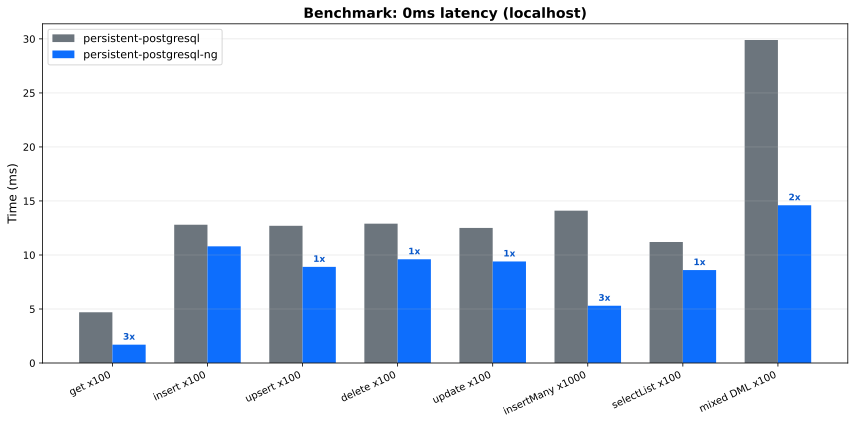
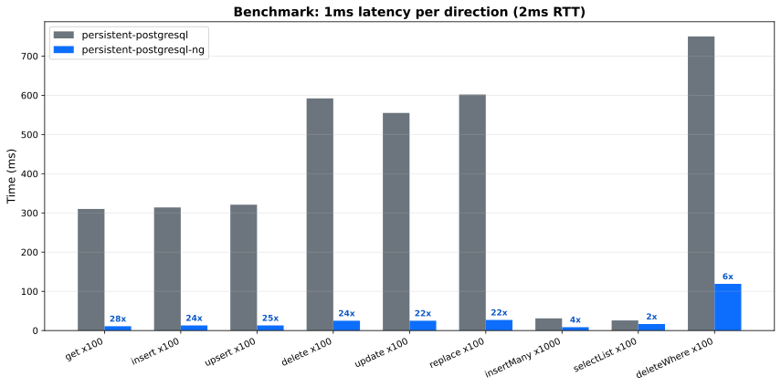
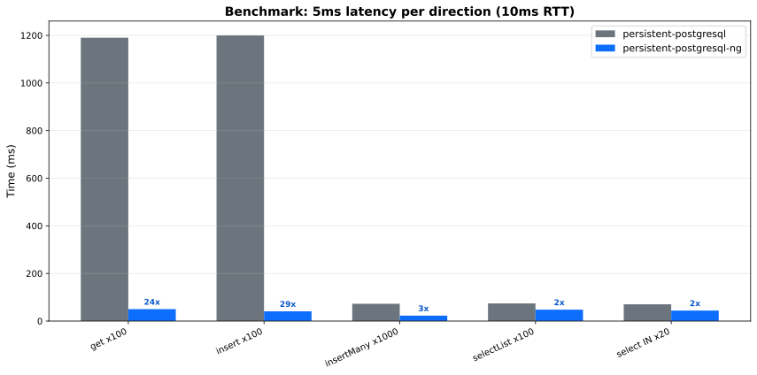

# persistent-postgresql-ng

A PostgreSQL backend for [persistent](https://hackage.haskell.org/package/persistent) that uses the **binary wire protocol** and **libpq pipeline mode**.

Mostly a drop-in replacement for `persistent-postgresql`. All standard persistent operations work without code changes aside from type signatures and import changes.

## What's different

| Feature | persistent-postgresql | persistent-postgresql-ng |
|---------|----------------------|--------------------------|
| Wire protocol | Text (via postgresql-simple) | Binary (via postgresql-binary) |
| Automatic pipelining | No | Yes–  Hedis-style lazy reply stream |
| Bulk insert | `INSERT ... VALUES (?,?,...), (?,?,...), ...` | `INSERT ... SELECT * FROM UNNEST($1::type[], ...)` |
| IN clauses | `IN (?,?,?,...)` | `= ANY($1)` |
| Direct decode path | No | Yes–  zero `PersistValue` allocation |
| Result fetch modes | All-at-once only | All-at-once, single-row, chunked (PG17+) |

## Benchmarks

Measured against `persistent-postgresql` on the same PostgreSQL 16 instance. Three network conditions: localhost (0ms), 1ms added latency per direction (2ms RTT), and 5ms per direction (10ms RTT).

Latency was introduced using a TCP delay proxy (`bench/delay-proxy.py`).

### 0ms latency (localhost, TCP loopback)




| Benchmark | pipeline | simple | speedup |
|-----------|----------|--------|---------|
| **get ×100 (pipelined reads)** | 1.7ms | 4.7ms | **2.8×** |
| **insert ×100 (pipelined RETURNING)** | 10.8ms | 12.8ms | 1.2× |
| **upsert ×100 (pipelined RETURNING)** | 8.9ms | 12.7ms | **1.4×** |
| insertMany ×1000 (UNNEST) | 5.3ms | 14.1ms | **2.7×** |
| delete ×100 then select | 4.5ms | 7.5ms | **1.7×** |
| mixed DML ×100 then select | 14.6ms | 29.9ms | **2.0×** |
| selectList ×100 | 8.6ms | 11.2ms | 1.3× |

At zero latency, the advantage comes from the binary protocol and UNNEST-based bulk inserts. Individual `get` and `insert` are comparable because round-trip time is negligible.

### 1ms latency per direction (2ms RTT, nearby datacenter)




| Benchmark | pipeline | simple | speedup |
|-----------|----------|--------|---------|
| **get ×100 (pipelined reads)** | **11ms** | 310ms | **28×** |
| **insert ×100 (pipelined RETURNING)** | **13ms** | 314ms | **24×** |
| **upsert ×100 (pipelined RETURNING)** | **13ms** | 321ms | **25×** |
| insertMany ×1000 (UNNEST) | 8.6ms | 31.0ms | **3.6×** |
| selectList ×100 | 16.6ms | 25.8ms | **1.6×** |
| select IN ×20 | 17.4ms | 24.8ms | **1.4×** |

With even modest latency, the automatic pipelining dominates. `mapM get keys`, `mapM insert records`, and `forM_ records upsert` all send queries before reading results–  one flush instead of 100 round-trips.

### 5ms latency per direction (10ms RTT, cross-region)




| Benchmark | pipeline | simple | speedup |
|-----------|----------|--------|---------|
| **get ×100 (pipelined reads)** | **50ms** | 1.19s | **24×** |
| **insert ×100 (pipelined RETURNING)** | **41ms** | 1.20s | **29×** |
| insertMany ×1000 (UNNEST) | 22.8ms | 72.6ms | **3.2×** |
| selectList ×100 | 47.9ms | 74.0ms | **1.5×** |
| select IN ×20 | 44.1ms | 70.3ms | **1.6×** |

The speedup scales linearly with latency. At 10ms RTT, 100 sequential round-trips cost 1000ms minimum. The pipeline pays one RTT for the flush and reads all 100 results from the server's already-buffered responses.

### Attributing the speedup: binary protocol vs pipelining

The improvements come from three independent sources. The 0ms column isolates the binary protocol effect (pipelining has no benefit when round-trips are free). The 1ms column shows the combined effect, and the difference reveals the pipelining contribution.

| Benchmark | 0ms: pipeline / simple | 1ms: pipeline / simple | Source of speedup |
|-----------|:---:|:---:|---|
| **get ×100** | 1.7ms / 4.7ms (2.8×) | 11ms / 310ms (**28×**) | 0ms: binary decode. 1ms: **Hedis-style lazy pipelining** (100 queries in 1 flush) |
| **insert ×100** | 10.8ms / 12.8ms (1.2×) | 13ms / 314ms (**24×**) | 0ms: binary encode. 1ms: **lazy RETURNING pipelining** |
| **delete ×100** | 8.4ms / 12.9ms (1.5×) | 25ms / 592ms (**24×**) | 0ms: binary protocol. 1ms: **fire-and-forget pipelining** |
| **update ×100** | 8.3ms / 12.5ms (1.5×) | 25ms / 555ms (**22×**) | 0ms: binary protocol. 1ms: **fire-and-forget pipelining** |
| **replace ×100** | 11.1ms / 11.5ms (1.0×) | 27ms / 602ms (**22×**) | 0ms: ~neutral. 1ms: **fire-and-forget pipelining** |
| **insertMany ×1000** | 7.2ms / 16.7ms (2.3×) | 8.6ms / 31.0ms (**3.6×**) | 0ms: **UNNEST** (1 query vs N). 1ms: UNNEST + fewer round-trips |
| **selectList ×100** | 13.5ms / 15.6ms (1.2×) | 16.6ms / 25.8ms (**1.6×**) | 0ms: binary decode. 1ms: binary + pipelined setup |
| **upsert ×100** | 8.9ms / 12.7ms (1.4×) | 13ms / 321ms (**25×**) | 0ms: binary protocol. 1ms: **lazy RETURNING pipelining** |
| **deleteWhere ×100** | 90ms / 99ms (1.1×) | 119ms / 750ms (**6.3×**) | 0ms: ~neutral. 1ms: **fire-and-forget pipelining** |

**Summary of sources:**

| Source | Typical gain at 0ms | Typical gain at 1ms/dir |
|--------|:---:|:---:|
| Binary protocol (encode/decode) | 1.2-2.8× | 1.2-2.8× |
| UNNEST bulk insert | 2.3× | 3.6× |
| Fire-and-forget DML pipelining | 1.0× | 20-24× |
| Hedis-style lazy pipelining (get, insert, upsert) | 1.0× | 24-28× |
| Combined (best case) | 2.8× | **28×** |

The binary protocol provides a constant-factor improvement regardless of latency. Pipelining provides a latency-proportional improvement that dominates at any non-zero network distance.

### Running benchmarks

```bash
# Baseline (direct connection)
stack bench persistent-postgresql-ng

# With artificial latency via TCP proxy
python3 bench/delay-proxy.py 15432 localhost 5432 1 &  # 1ms per direction
PGPORT=15432 PGHOST=127.0.0.1 stack bench persistent-postgresql-ng
kill %1

# With system-level latency (macOS, requires root)
sudo bench/run-with-latency.sh 1   # 1ms via dummynet
```

## Automatic pipelining (Hedis-style)

All read operations (`get`, `getBy`, `insert` with RETURNING, `count`, `exists`) use a [Hedis-style](https://www.iankduncan.com/engineering/2026-02-17-archive-redis-pipelining) lazy reply stream for automatic optimal pipelining. No API changes are required–  standard persistent code like `mapM get keys` is automatically pipelined.

The technique:

1. At connection time, an infinite lazy list of server replies is created using `unsafeInterleaveIO`. Each element, when forced, flushes the send buffer and reads one result.
2. Each command **sends** eagerly (writes to the output buffer) and **receives** lazily (pops an unevaluated thunk from the reply list via `atomicModifyIORef`).
3. The actual network read happens when the caller inspects the result value. If 100 `get` calls are sequenced before any result is inspected, all 100 queries are sent in one flush and results are read sequentially from the server's response buffer.

The ordering guarantee comes from the lazy list structure: each thunk N is created inside thunk N-1's `unsafeInterleaveIO` body, so replies are always read in pipeline order regardless of evaluation order.

Write operations (`delete`, `update`, `replace`, `deleteWhere`, `updateWhere`) remain fire-and-forget–  they send the query and don't read the result until a subsequent read operation (or transaction commit) drains them.

## Direct decode path

In addition to the standard `PersistValue`-based path, the backend supports a direct codec path that bypasses `PersistValue` entirely. See the [RFC](../RFC-direct-decode.md) for full design details.

```haskell
-- Switch one import to opt in:
import Database.Persist.Sql.Experimental  -- instead of Database.Persist.Sql
```

For code with the concrete backend type (zero overhead, full specialization):

```haskell
rawSqlDirect
    "SELECT name, age FROM users WHERE age > $1"
    (writeParam (18 :: Int))
    :: ReaderT (WriteBackend PostgreSQLBackend) m [(Text, Int64)]
```

For code through `SqlBackend` (uses `DirectEntity` + `Typeable` bridge):

```haskell
rawSqlDirectCompat
    "SELECT name, age FROM users WHERE age > $1"
    [toPersistValue (18 :: Int)]
    :: ReaderT SqlBackend m (Maybe [(Text, Int64)])
```

## Architecture

See [ARCHITECTURE.md](ARCHITECTURE.md) for detailed internals: pipeline mode, binary protocol, connection lifecycle, error handling, and the direct decode/encode layer.
